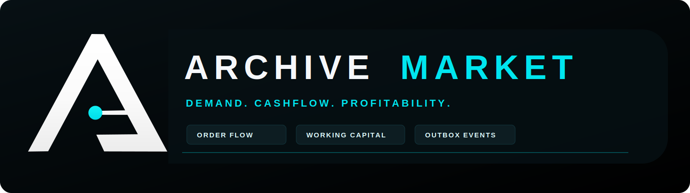
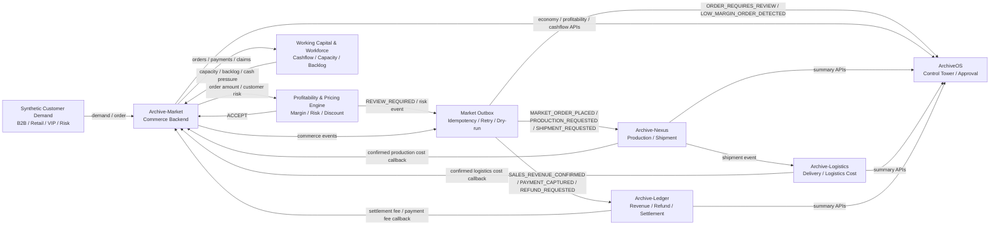

<p align="center">
  
</p>

# Archive-Market

Archive-Market은 Archive Platform Ecosystem의 외부 수요, 주문, 결제, 매출, 반품, 클레임 이벤트를 생성하고 주문별 수익성, 운영 자금, 인력 생산성까지 계산하는 Spring Boot 기반 Synthetic Commerce Backend입니다.

이 저장소는 실제 상거래 운영 시스템이 아니라 포트폴리오와 비즈니스 시뮬레이션을 위한 합성 데이터 기반 백엔드입니다. 실제 개인정보, 실제 주소, 실제 카드번호, 실제 결제정보, 실제 금융 데이터, 실제 PG/카드/배송사 API를 사용하지 않습니다.

## 역할

- 외부 고객 수요와 주문 생성
- 결제, 매출, 환불, 클레임 이벤트 생성
- Archive-Nexus 생산/출하 요청 이벤트 생성
- Archive-Ledger 매출/환불/수수료 정산 이벤트 생성
- ArchiveOS가 읽을 economy, operations, profitability, cashflow summary 제공
- 주문별 예상 수익성, 위험도, 할인 가능 여부 평가
- 저마진/고위험 주문을 ArchiveOS 승인 대상으로 outbox 기록
- Nexus, Logistics, Ledger 실측 비용 이벤트를 주문 수익성 cost component에 반영
- 운영 자금, workforce capacity, backlog, productivity score 계산

## Ecosystem 연결

- Archive-Market: 외부 수요, 주문, 결제, 매출, 수익성 판단, 운영 현금흐름
- Archive-Nexus: Market 주문 기반 생산, 재고, 출하 이벤트 생성
- Archive-Logistics: Nexus 출하 기반 배송, 운송비, 지연 비용 계산
- Archive-Ledger: Market 매출/환불/클레임, Nexus 비용, Logistics 비용 정산
- ArchiveOS: 손익, cash, risk, approval, settlement 상태 관제

## Ecosystem Flow



## 기술 스택

- Java 21
- Spring Boot 3.x
- Gradle
- Spring Web / Validation / Data JPA
- PostgreSQL
- Flyway
- Spring Batch
- Actuator / Micrometer
- springdoc-openapi
- JUnit 5 / AssertJ / Testcontainers
- Docker / Docker Compose
- GitHub Actions

## 빠른 실행

```powershell
docker compose up --build -d
curl.exe http://localhost:8094/actuator/health
curl.exe http://localhost:8094/api/operations/summary
```

기본 포트:

- 애플리케이션: `8094`
- PostgreSQL: `15435:5432`

기본 profile:

- `local`

## 웹 화면

- 홈페이지: `http://localhost:8094/`
- 운영 대시보드: `http://localhost:8094/dashboard/`
- Swagger UI: `http://localhost:8094/swagger-ui/index.html`
- Health: `http://localhost:8094/actuator/health`

정적 웹 화면, 브라우저 북마크 아이콘, README 브랜드 이미지는 Archive 로고를 기반으로 구성했습니다.

- `src/main/resources/static/assets/archive-logo.png`
- `src/main/resources/static/assets/archive-market-lockup.svg`
- `docs/brand/archive-market-lockup.svg`

대시보드는 최근 추가된 다국어 흐름에 맞춰 한국어 중심 UI를 기본으로 구성하고, 운영 요약과 Market 지표를 바로 확인할 수 있게 만들었습니다.

## 주요 API

### Operations

- `GET /actuator/health`
- `GET /actuator/info`
- `GET /actuator/metrics`
- `GET /api/operations/summary`

### Customer / Product

- `GET /api/customers`
- `GET /api/customers/{customerId}/risk-profile`
- `POST /api/customers/{customerId}/risk-profile/recalculate`
- `GET /api/products`
- `POST /api/products/seed`

### Order / Payment

- `POST /api/orders`
- `POST /api/orders/simulate?count=100`
- `GET /api/orders`
- `GET /api/orders/{orderId}`
- `POST /api/orders/{orderId}/confirm`
- `POST /api/orders/{orderId}/cancel`
- `POST /api/payments/capture?orderId={orderId}`
- `POST /api/payments/refund?orderId={orderId}`
- `GET /api/payments`

### Profitability / Pricing / Risk

- `GET /api/pricing/policies`
- `POST /api/pricing/policies/seed`
- `POST /api/pricing/recommend`
- `POST /api/orders/{orderId}/profitability/evaluate`
- `GET /api/orders/{orderId}/profitability`
- `GET /api/orders/{orderId}/profitability/cost-adjustments`
- `GET /api/market-profitability/summary`
- `GET /api/market-profitability/assessments`
- `GET /api/customers/{customerId}/risk-profile`
- `POST /api/customers/{customerId}/risk-profile/recalculate`

### Returns / Claims

- `POST /api/returns?orderId={orderId}`
- `POST /api/claims?orderId={orderId}`
- `GET /api/returns`
- `GET /api/claims`

### Economy / Outbox / Inbox

- `GET /api/market-economy/summary`
- `GET /api/market-economy/revenue-events`
- `GET /api/market-economy/cost-events`
- `GET /api/market-economy/profit-snapshots`
- `POST /api/market-economy/daily-close?date=YYYY-MM-DD`
- `GET /api/outbox/summary`
- `GET /api/outbox/events`
- `POST /api/outbox/publish`
- `POST /api/outbox/retry-failed`
- `POST /api/events/external`
- `POST /api/events/external/bulk`
- `GET /api/events/inbox`

### Cashflow / Workforce / Productivity

- `GET /api/market-cashflow/summary`
- `GET /api/market-workforce/summary`
- `GET /api/market-productivity/summary`
- `POST /api/market-workforce/allocate`

### Simulation

- `POST /api/simulations/demand?count=100`
- `POST /api/simulations/orders?count=100`
- `POST /api/simulations/profitability?count=100`
- `POST /api/simulations/workday/run?date=YYYY-MM-DD`
- `POST /api/simulations/day/run?date=YYYY-MM-DD`

## 주문 수익성 및 가격 정책 엔진

Archive-Market은 주문을 무조건 확정하지 않고 예상 매출과 예상 비용을 계산해 주문별 recommendation을 남깁니다.

Expected Revenue:

- 주문 금액
- Express order fee
- Service contract revenue
- Premium handling fee

Expected Cost:

- 예상 생산 비용
- 예상 물류 비용
- Ledger 정산 수수료
- 결제 처리 수수료
- 할인 비용
- 기대 반품 비용
- 기대 클레임 비용
- 고객 획득 비용
- Market 운영 비용

계산식:

```text
Expected Profit = Expected Revenue - Expected Cost
Expected Margin Rate = Expected Profit / Expected Revenue * 100
```

추천 결과:

- `ACCEPT`
- `REVIEW_REQUIRED`
- `REJECT_RECOMMENDED`

`REJECT_RECOMMENDED`는 권고값이며 주문을 자동 취소하지 않습니다. 실제 취소나 승인은 별도 API 또는 ArchiveOS 의사결정 흐름에서 처리하도록 설계했습니다.

기본 정책 예:

- 결제 처리 수수료율: `2.0%`
- Ledger 정산 수수료율: `0.3%`
- Ledger 고정 수수료: `100 KRW`
- 기본 물류비 추정: `50,000 KRW`
- 긴급 물류 surcharge: `30,000 KRW`
- DISCOUNT_SEEKER 할인율: `10%`
- VIP_CUSTOMER 할인율: `5%`
- B2B_CUSTOMER 할인율: `3%`

## 실측 비용 어댑터

Nexus, Logistics, Ledger가 보내는 synthetic 실측 비용 이벤트는 기존 external inbox로 수신합니다.

- Archive-Nexus: 생산/제조 비용을 `PRODUCTION_COST`에 반영
- Archive-Logistics: 배송/운송 비용을 `LOGISTICS_COST`에 반영
- Archive-Ledger: 정산 수수료와 결제 처리 수수료를 `LEDGER_SETTLEMENT_FEE`, `PAYMENT_PROCESSING_FEE`에 반영

적용된 비용 조정은 `profitability_cost_component_adjustment`에 기록하고, 기존 `order_profitability_assessment`의 총비용, 예상이익, 마진율, recommendation을 재계산합니다. 실측 비용 어댑터는 외부 이벤트 수신에 따른 재평가만 수행하며 ArchiveOS review 이벤트를 다시 발행하지 않아 순환 이벤트를 방지합니다.

## Working Capital & Workforce 모델

Archive-Market은 Ledger의 최종 정산/원장 기준과 별개로 Market 운영 현금흐름을 표시합니다.

Cashflow 항목:

- `availableCash`
- `expectedReceivable`
- `pendingSettlementAmount`
- `payrollCost`
- `productionRequestCost`
- `logisticsRequestCost`
- `ledgerFee`
- `netProfit`
- `workingCapital`

Synthetic workforce 역할:

- `ORDER_OPERATOR`
- `PRICING_ANALYST`
- `CUSTOMER_SUPPORT`
- `CLAIM_HANDLER`
- `MARKET_MANAGER`

각 역할은 `capacityPerDay`, `wagePerDay`, `productivityScore`를 가집니다. 주문 수가 workforce capacity를 초과하면 backlog로 계산하고, backlog가 커질수록 cancellationRate, claimRate, delayRisk가 증가합니다.

Productivity summary는 다음 의사결정 힌트를 제공합니다.

- 인력 증원
- 할인 축소
- 고위험 주문 보류
- 클레임 처리 우선순위 조정

## 이벤트 계약

Outbox target:

- `NEXUS`
- `LEDGER`
- `ARCHIVE_OS`

Nexus 이벤트:

- `MARKET_ORDER_PLACED`
- `PRODUCTION_REQUESTED`
- `SHIPMENT_REQUESTED`
- `ORDER_CANCELLED`
- `RETURN_REQUESTED`
- `QUALITY_CLAIM_CREATED`

Ledger 이벤트:

- `SALES_REVENUE_CONFIRMED`
- `PAYMENT_CAPTURED`
- `REFUND_REQUESTED`
- `CLAIM_COMPENSATION_CONFIRMED`
- `MARKET_SERVICE_FEE_PAID`
- `PAYMENT_PROCESSING_FEE_PAID`

ArchiveOS review 이벤트:

- `ORDER_REQUIRES_REVIEW`
- `LOW_MARGIN_ORDER_DETECTED`
- `HIGH_RISK_ORDER_DETECTED`

모든 외부 이벤트 envelope에는 순환 방지를 위해 다음 필드를 포함합니다.

- `simulationRunId`
- `settlementCycleId`
- `correlationId`
- `causationId`
- `hopCount`
- `maxHop`
- `idempotencyKey`

안전 규칙:

- `hopCount > maxHop` 이벤트는 거부 또는 publish 차단
- `eventId` 또는 `idempotencyKey` 중복 이벤트는 재처리하지 않음
- payment/refund/review/fee 이벤트가 다시 무한 평가나 fee 이벤트를 만들지 않도록 상태와 idempotency로 방어
- 실측 비용 어댑터는 assessment cost component만 갱신하고 review outbox를 재발행하지 않음

## DB Migration

- `V1__init_market_schema.sql`: Market 기본 도메인, outbox/inbox, audit, daily close
- `V2__create_spring_batch_tables.sql`: Spring Batch 메타 테이블
- `V3__add_indexes.sql`: 조회/중복 방지 인덱스
- `V4__add_profitability_pricing_engine.sql`: pricing policy, profitability assessment, risk profile, price recommendation
- `V5__add_profitability_cost_component_adjustments.sql`: 실측 비용 component adjustment
- `V6__add_working_capital_workforce_model.sql`: workforce allocation, workday snapshot

## Smoke Test

```powershell
curl.exe -X POST http://localhost:8094/api/products/seed
curl.exe -X POST "http://localhost:8094/api/simulations/orders?count=100"
curl.exe http://localhost:8094/api/operations/summary
curl.exe http://localhost:8094/api/market-economy/summary
curl.exe http://localhost:8094/api/market-profitability/summary
curl.exe http://localhost:8094/api/market-cashflow/summary
curl.exe http://localhost:8094/api/market-workforce/summary
curl.exe http://localhost:8094/api/market-productivity/summary
curl.exe http://localhost:8094/api/outbox/summary
curl.exe -X POST http://localhost:8094/api/outbox/publish
```

`market.integration.enabled=false`이면 outbox publish는 Nexus, Ledger, ArchiveOS를 실제 호출하지 않고 `DRY_RUN` 또는 `SKIPPED` 상태로 처리합니다.

## 로컬 검증

```powershell
.\gradlew.bat test --no-daemon --console=plain
.\gradlew.bat build --no-daemon --console=plain
docker compose config --quiet
```

## 문서

- `docs/architecture.md`
- `docs/event-contract.md`
- `docs/market-economy-model.md`
- `docs/profitability-engine.md`
- `docs/pricing-policy.md`
- `docs/customer-risk-profile.md`
- `docs/measured-cost-adapters.md`
- `docs/archiveos-review-event-contract.md`
- `docs/nexus-integration-contract.md`
- `docs/ledger-integration-contract.md`
- `docs/archiveos-integration-contract.md`
- `docs/simulation-scenario.md`
- `docs/operations-runbook.md`
- `docs/portfolio-bullets.md`
- `docs/api-examples.http`

## 다른 프로젝트 연동 요약

Nexus는 Market outbox의 `MARKET_ORDER_PLACED`, `PRODUCTION_REQUESTED`, `SHIPMENT_REQUESTED` 이벤트를 기준으로 생산/출하 흐름을 시작하면 됩니다. 생산 실측 비용이 확정되면 `POST /api/events/external`로 synthetic production cost 이벤트를 보내 Market profitability assessment를 갱신할 수 있습니다.

Logistics는 Nexus 출하 이후 배송/운송 비용을 계산하고, synthetic logistics cost 이벤트를 `POST /api/events/external`로 전달하면 Market의 `LOGISTICS_COST` component에 반영됩니다.

Ledger는 Market의 `SALES_REVENUE_CONFIRMED`, `PAYMENT_CAPTURED`, `REFUND_REQUESTED`, `CLAIM_COMPENSATION_CONFIRMED` 이벤트를 정산 기준으로 처리합니다. 정산 수수료나 결제 처리 수수료가 확정되면 external inbox로 실측 비용 이벤트를 보내 Market 평가 비용을 보정할 수 있습니다.

ArchiveOS는 다음 API를 읽어 Market의 수요, 매출, 수익성, 자금, 인력 상태를 관제하면 됩니다.

- `GET /api/market-economy/summary`
- `GET /api/operations/summary`
- `GET /api/outbox/summary`
- `GET /api/orders`
- `GET /api/claims`
- `GET /api/returns`
- `GET /api/market-profitability/summary`
- `GET /api/market-cashflow/summary`
- `GET /api/market-workforce/summary`
- `GET /api/market-productivity/summary`
